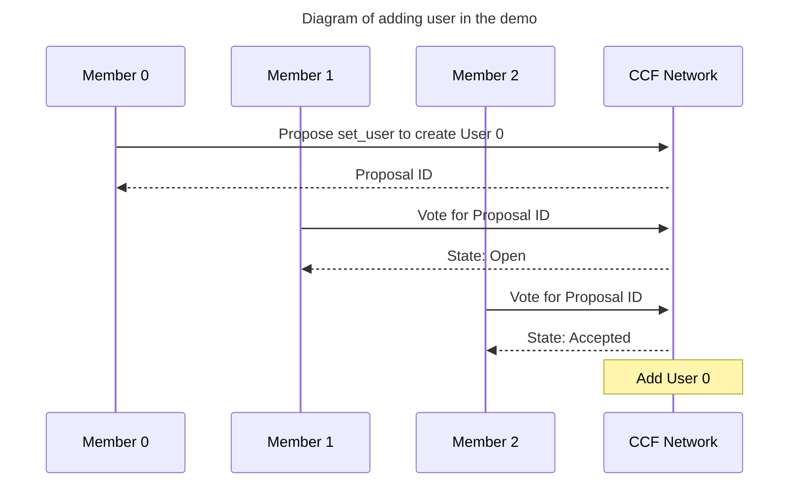
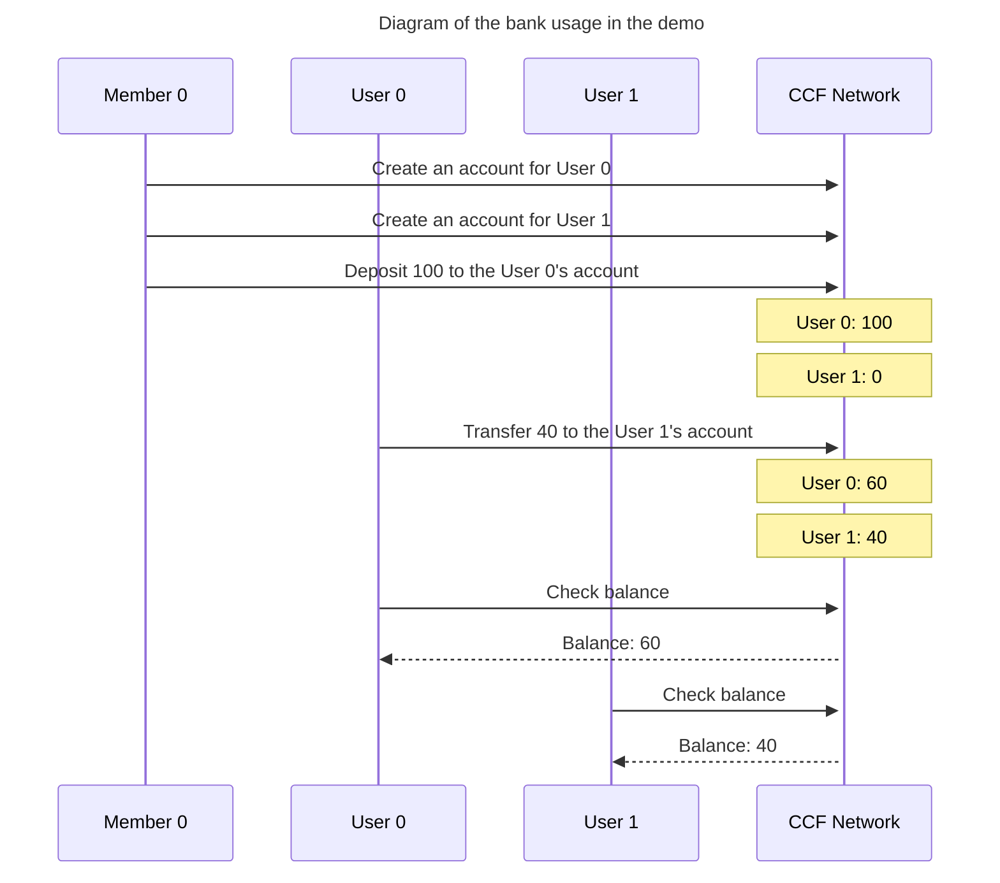

# Banking application

This is a sample application of a bank consortium.

## Use case

A bank system that can be run by multiple banks is required.

## What the application does

This application provides a REST API with the following endpoints:

- PUT `/app/account/{user_id}/{account_name}`
  - Create account for a bank account holder
  - It can be called by banks ([members](https://microsoft.github.io/CCF/main/overview/glossary.html#term-Members) in CCF terminology)
  - Status code for successful calls: 204
- POST `/app/deposit/{user_id}/{account_name}`
  - Deposit money
  - It can be called by banks ([members](https://microsoft.github.io/CCF/main/overview/glossary.html#term-Members) in CCF terminology)
  - Example request body: `{ "value" : 100 }`
  - Status code for successful calls: 204
- GET `/app/balance/{account_name}`
  - Check balance
  - It can be called by bank account holders ([users](https://microsoft.github.io/CCF/main/overview/glossary.html#term-Users) in CCF terminology)
  - Example response: Status code 200 with body `{ "balance" : 100 }`
- POST `/app/transfer/{account_name}`
  - Transfer money from an account to another account
  - It can be called by bank account holders ([users](https://microsoft.github.io/CCF/main/overview/glossary.html#term-Users) in CCF terminology)
  - Example request body: `{ value : 100, user_id_to: 'userA' , account_name_to: 'accountA' }`
  - Status code for successful calls: 204

### Why "Deposit money" API (`POST /app/deposit/{user_id}/{account_name}`) can't be called by users not members?

In real life, it's normal that users can deposit money through an ATM at their own will. So it might be unintuitive that users can't call the endpoint. However if we allow users, they could deposit any amount of money with no actual money.
If you want implement an ATM, the deposit procedure would be:

1. User puts actual money into an ATM.
2. The ATM counts the money.
3. The ATM calls "Deposit money" API as the bank.

## Why CCF?

There are multiple reasons that you want to use CCF for a banking consortium.

- The ledger generated by CCF is tamper-proof, it cannot be modified after having been produced; it is immutable. Even users without a full copy of the ledger, holding their transaction receipts, are protected.
- Users can use [transaction receipts](https://microsoft.github.io/CCF/main/audit/receipts.html#receipts) with [application claim](https://microsoft.github.io/CCF/main/use_apps/verify_tx.html#application-claims) as proof of transferring money even without online access to the system.
- Banks don't have to trust each other. A majority of the banks need to agree to make changes on the application with the default [constitution](https://microsoft.github.io/CCF/main/governance/constitution.html#constitution).
- Banks and users don't have to trust node [operators](https://microsoft.github.io/CCF/main/overview/glossary.html#term-Operators).

## Demo

You can use the demo to understand a typical scenario.

### Scenario in the demo

In this scenario, the bank consortium has 3 banks as CCF members.
Scenario is the following:

1. Banks add 2 users (user0, user1) using CCF's governance mechanism (See [The CCF document](https://microsoft.github.io/CCF/main/governance/open_network.html#adding-users) for the details).
2. A bank creates an account for each user.
3. A bank deposit 100 to the user0's account
4. user0 transfers 40 to the user1's account.
5. user0 and user1 check their balance. The result should be 60 and 40 respectively.





### How to run the demo

```bash
cd banking-app
make start-host

# In another terminal
cd banking-app
make demo
```

## How to run the tests

The banking application also has a suite of tests that run in a sandbox; please ensure you do not have an existing sandbox running.

```bash
cd banking-app
make test
```

## Interact with the sandbox manually

You can always run the sandbox yourself: -

```bash
cd banking-app
# The dev container would have installed your npm packages for you

npm run build # Transpile the TypeScript code to JavaScript and copy the output to `dist` directory

initial_number_of_banks=3
initial_number_of_users=2
/opt/ccf_virtual/bin/sandbox.sh --js-app-bundle ./dist/ --initial-member-count $initial_number_of_banks --initial-user-count $initial_number_of_users
```

You can find example commands to use against the application in `./demo.sh`.

## Creating a container image for manually dispatch a CCF Network

```bash
cd banking-app
make build-virtual # to generate a virtual CCF Network
make build-enclave # to generate a enclave CCF Network
```

Both make targets execute the same script: `build_image.sh`. This script expects `virtual|enclave` as parameters, and the differentiation between which image to generate and config files to use is done through the argument passed to it.

The script performs the following:

- create a `workspace/docker_certificates` folder to store the needed certificates
- copy the configuration files for the images `../config/cchost_config_{setupType}_js.json`
- generate member0 certificates (needed to start CCF network)
- Build the container image
- remove the config files' copies

From this point, you can run your image and start governance actions on your CCF network.
