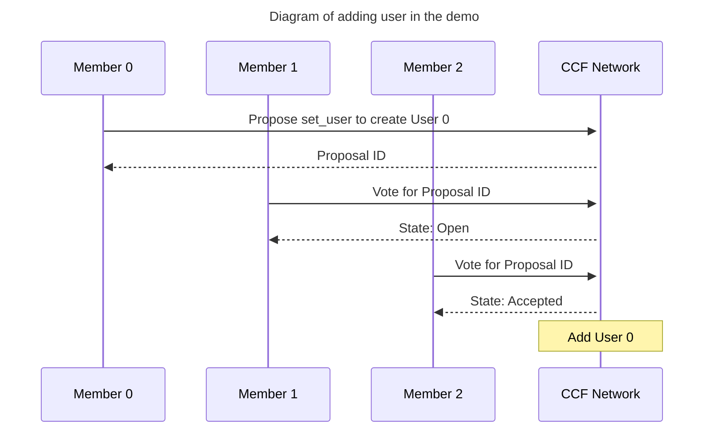
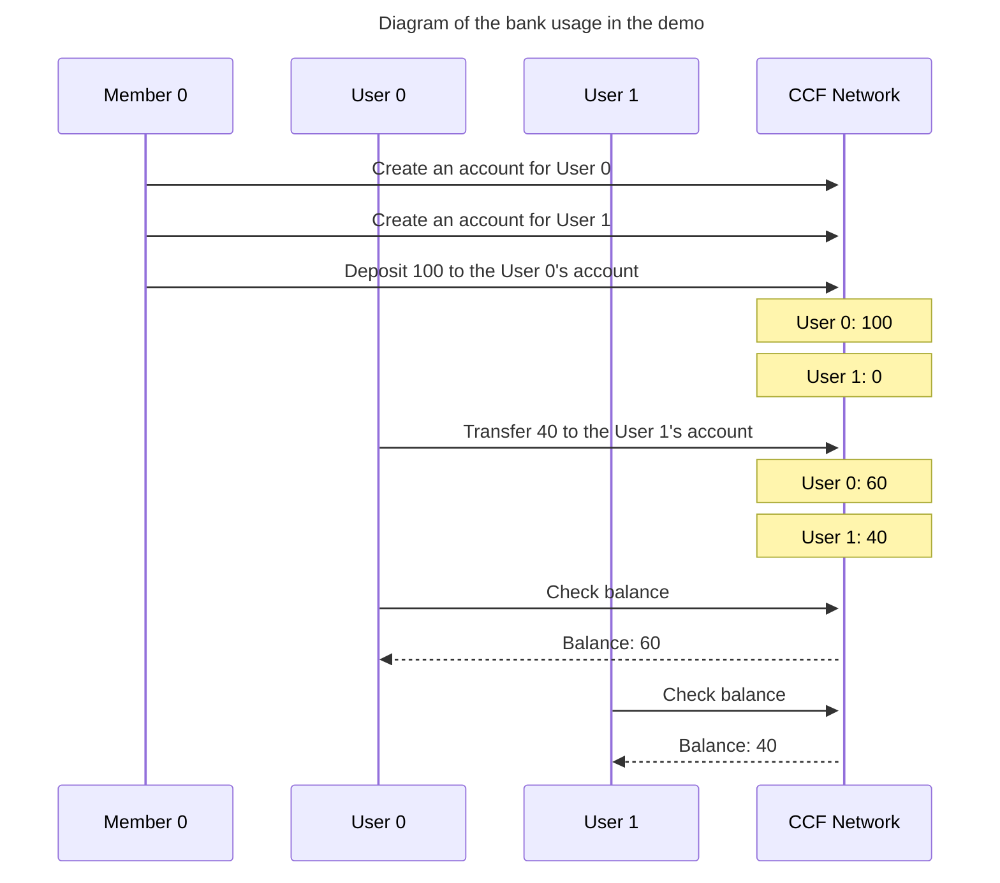

# banking-app

This is a sample application of bank consortium.

## Use case

A bank system that can be run by multiple banks is required.

## What the app does?

This application provides REST-ish API with following endpoints:

- PUT /app/account/{user_id}/{account_name}
    - Create account for a bank user
    - It can be called by banks ([members](https://microsoft.github.io/CCF/main/overview/glossary.html#term-Members) in CCF terminology)
    - Status code for successful calls: 204
- POST /app/deposit/{user_id}/{account_name}
    - Deposit money
    - It can be called by banks ([members](https://microsoft.github.io/CCF/main/overview/glossary.html#term-Members) in CCF terminology)
    - Example request body: `{ "value" : 100 }`
    - Status code for successful calls: 204
- GET /app/balance/{account_name}
    - Check balance
    - It can be called by bank users ([users](https://microsoft.github.io/CCF/main/overview/glossary.html#term-Users) in CCF terminology)
    - Example response: Status code 200 with body `{ "balance" : 100 }`
- POST /app/transfer/{account_name}
    - Transfer money from an account to another account
    - It can be called by bank users ([users](https://microsoft.github.io/CCF/main/overview/glossary.html#term-Users) in CCF terminology)
    - Example request body: `{ value : 100, user_id_to: 'userA' , account_name_to: 'accountA' }`
    - Status code for successful calls: 204

### Why "Deposit money" API (`POST /app/deposit/{user_id}/{account_name}`) can't be called by users not members?

In real life, it's normal that users can deposit money through ATM at their own will. So it might be unintuitive that users can't call the endpoint. However if we allow users, they could deposit any amount of money with no actual money.
If you want implement an ATM, the deposit procedure would be:
1. User puts actual money into an ATM.
2. The ATM counts the money.
3. The ATM calls "Deposit money" API as bank.


## Why CCF?

There are multiple reasons that you want to use CCF for banking consortium.

TODO

## How to run the app in sandbox

```bash
$ cd banking-app
$ npm i # Necessary only for the first time

$ npm run build # Transpile the TypeScript code to JavaScript and copy the output to `dist` directory 

$ initial_number_of_banks=3
$ initial_number_of_users=2
$ /opt/ccf/bin/sandbox.sh --js-app-bundle ./dist/ --initial-member-count $initial_number_of_banks --initial-user-count $initial_number_of_users
```

You can find example commands to use the application in demo.sh, or you can run a series of commands by following the next section (Please do not forget to stop the sandbox before moving on)

## Demo

You can use the demo to understand a typical scenario.

### Scenario in the demo

In this scenario, the bank consortium has 3 banks as CCF members.
Scenario is the following:
1. Banks add 2 users (user0, user1) using CCF's governance mechanism (See [The CCF document](https://microsoft.github.io/CCF/main/governance/open_network.html#adding-users) for the details).
2. A bank creates an account for each user.
3. A bank deposit 100 to the user0's account
4. user0 transfers 40 to the user1's account.
5. user0 and user1 check their balance. The result should be 60 and 40 respectively.





### How to run the demo

```bash
$ cd banking-app
$ npm i # Necessary only for the first time
$ ./prepare_demo.sh

# In another terminal
$ cd banking-app
$ ./demo.sh
$ ./show_app_log.sh # You can see the application log
```

## How to run test

banking-app has a test.

```bash
$ cd banking-app
$ npm i # Necessary only for the first time
$ ./test.sh
```
