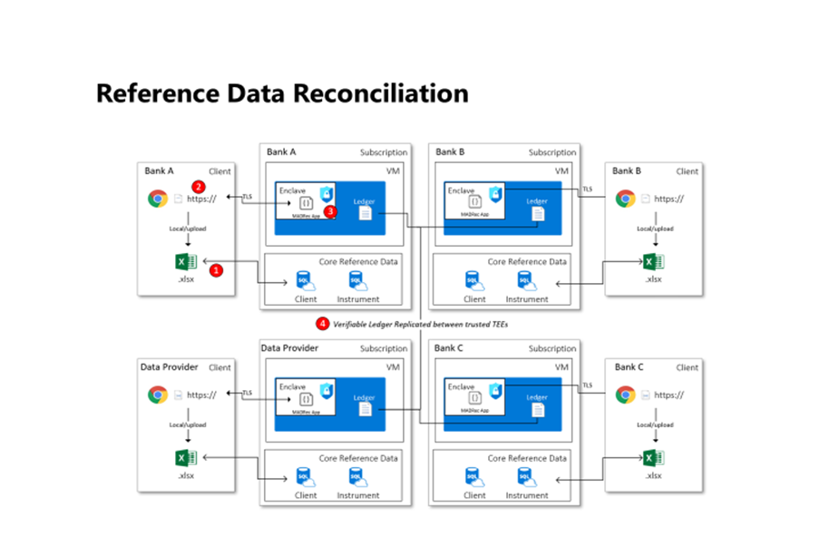

# CCF Data Reconciliation Application

This is the repo for _CCF Data Reconciliation - sample_.

## Overview

The CCF network will be used to host a reconciliation service where different parties with membership (banks and data providers) will be able to submit their own data to be reconciled against "each other's data" in a confidential manner without exposing the data to other members in the network.

The sample will use the voting process to reconcile members' data; on the data submission, when new record is submitted the app will check if it does not exist in the key-value store, it will be added; otherwise, a vote is added to this record with a member ID, and the vote will be "agree" if data attributes match; otherwise, it will "disagree."

## Architecture

This is a work in progress overview of the current architecture and key interactions and integrations.



## Getting Started

To get started run `cd data-reconciliation-app && make test` to run the application locally.

### Repo Layout

```text
📂
├── docs                Sample application documentation
│   └── adrs            All Architecture decision records (ADR)
│
├── governance
│   └── constitution    CCF network constitution files
│   └── vote            Contains proposal voting acceptance and rejection logic
│   └── config          CCF network nodes configs
│   └── scripts         All governance scripts
│
└── src                 Application source code
│    └── endpoints      Application endpoints implementation
│
└── test
│    └── unit-test      Application unit tests
│    └── e2e-test       Application end to end tests
│
└── deploy              Scripts to deploy to the application
└── demo                Scripts to run demo

```

### Running Locally

A makefile provides a frontend to interacting with the project, this is used both locally and during CI and GitHub Actions. This makefile is self documenting, and has the following targets:

```text
help                 💬 This help message :)
lint                 🌟 Lint & format, will not fix but sets exit code on error, use in CI
lint-fix             🔍 Lint & format, try to fix & update code, run locally
build                🔨 Build the Application
test                 🧪 Run tests, used for local development
start-host           🏃 Start the application on a test CCF network
deploy               🏡 Deploy application to Azure mCCF
destroy              💣 Destroy application
e2e-test             🤖 Run end to end tests
clean                🧹 Clean up local files
```
