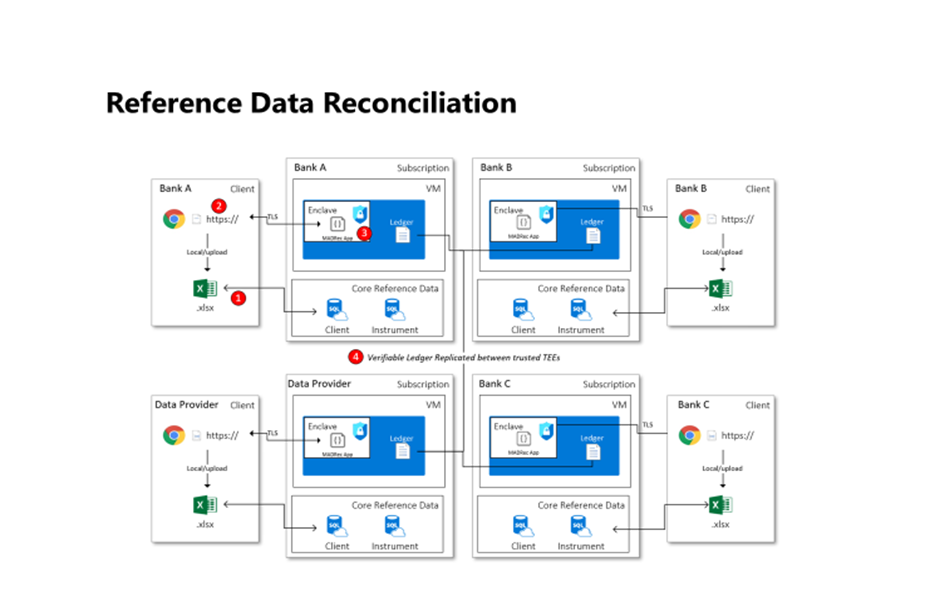

# CCF Data Reconciliation Application

This is the repo for _CCF Data Reconciliation - sample_.

## Overview

The CCF network will be used to host a reconciliation service where different parties with membership (banks and data providers) will be able to submit their own data to be reconciled against "each other's data" in a confidential manner without exposing the data to other members in the network.

The sample will use the voting process to reconcile members' data; on the data submission, when new record is submitted the app will check if it does not exist in the key-value store, it will be added; otherwise, a vote is added to this record with a member ID, and the vote will be "agree" if data attributes match; otherwise, it will "disagree."

## Architecture

This is a work in progress overview of the current architecture and key interactions and integrations.



## Getting Started

To get started run `cd data-reconciliation-app && make test` to run the application locally.

### Repo Layout

```text
📂
├── docs                Sample application documentation
│   └── adrs            All Architecture decision records (ADR)
│
├── governance
│   └── constitution    CCF network constitution files
│   └── nodes           CCF network nodes configs
│   └── scripts         All governance scripts
│   └── vote            Contains proposal voting acceptance and rejection logic
│
└── src                 Application source code
│
└── test
│    └── e2e-test       Application end to end tests
│    └── unit-test      Application unit tests
```

### Running Locally

A makefile provides a frontend to interacting with the project, this is used both locally and during CI and GitHub Actions. This makefile is self documenting, and has the following targets:

```text
help                 💬 This help message :)
build                🔨 Build the Application
build-virtual        📦 Build Virtual container image from Dockerfile
build-enclave        📦 Build Enclave container image from Dockerfile
start-host           🏃 Start the CCF network using Sandbox.sh
test                 🧪 Test the Data Reconciliation Application in the sandbox
test-docker-virtual  🧪 Test the Data Reconciliation Application in a Docker sandbox
test-docker-enclave  🧪 Test the Data Reconciliation Application in a Docker enclave
test-mccf            🧪 Test the Data Reconciliation Application in a Managed CCF environment
e2e-test             🧪 Run end to end tests
unit-test            🧪 Run the Application unit-test
demo                 🎬 Demo the Data Reconciliation Application
demo-code-change     🎬 Demo the Data Reconciliation Application Code Change
clean                🧹 Clean the working folders created during build/demo
```

## Testing

There are 3 different types of network that this sample can be tested against; Sandbox, Docker, and Managed CCF. The script [./test.sh](./test/test.sh) is specific to this sample and is called by wrapper scripts that exist in the root [scripts](../scripts/) folder. These wrapper scripts are used for all samples.

| Network | Command | Script |
| ------: | -----: | ------: |
| Sandbox |  `make test` | [test_sandbox](../scripts/test_sandbox.sh) |
| Docker | `make test-docker-virtual` and `make test-docker-enclave` | [test_docker](../scripts/test_docker.sh) |
| Managed CCF | `make test-mccf` | [test_mccf](../scripts/test_docker.sh) |

The wrapper scripts are responsible for starting the particular network with the correct constitution and setting up the governance (users/members/application). The wrapper scripts will also close the network after the tests have finished (excluding mCCF).

### Demo

It is also possible to run the tests in *Demo mode*. This can be achieved by runing
```bash
cd data-reconciliation-app && make demo
```
There is a [guide](./docs/demo-guidance.md) here explaining what the demo shows. This will run the tests but require manual intervention so you can inspect the state of the network.
