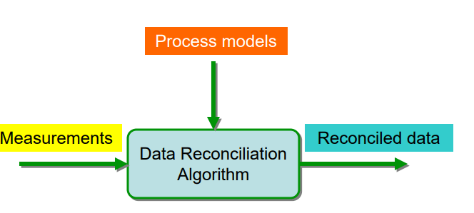
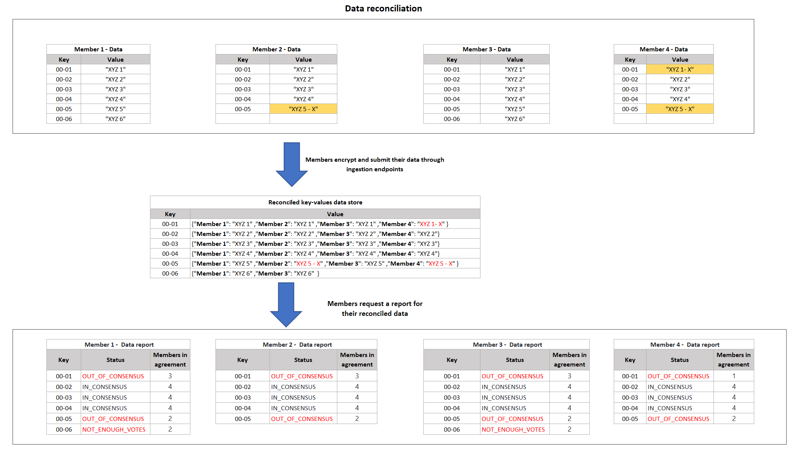

# What is data reconciliation means in the context of the project?

## _Reconciliation Overview_

Generally speaking, data reconciliation is used describe a verification phase where the target data is compared against original source data to address a range of issues:

- Missing records
- Missing values
- Incorrect values
- Duplicated records
- Badly formatted values
- Broken relationships across tables or systems

However, in many scenarios, there may not exist a single source of truth to compare your target data against. Rather, institutions can come together in a network to consolidate, compare and identify issues with their own data. One of the benefits of a CCF network is that these institutions can do so confidently, without actually sharing their data with one another.

Some potential use cases may involve:

- In finance, a number of financial institutions coming together to predict the price of a derivative.
- In finance, a number of financial institutions coming together to reconcile reference data or ticker symbols.
- In healthcare, a number of hospitals coming together to reconcile hospital records for patients.



## Proposed solution

The CCF network will be used to host a reconciliation service where different parties with membership (banks and data providers) will be able to submit their own data to be reconciled against "each other's data" in a confidential manner without exposing the data to other members in the network.

The solution will use the voting process to reconcile members' data; on the data submission, when new record is submitted the app will check if it does not exist in the key-value store, it will be added; otherwise, a vote is added to this record with a member ID, and the vote will be "agree" if data attributes match; otherwise, it will "disagree."

This solution is generic to handle scenarios of data collaboration amongst different parties, and share reconciled results out on that data.

## Assumptions

- The application will accept data that conforms to the `agreed schema`
- The schema must has a unique identifier and attributes associated with this identifier
- The Data is compared across all members, no one source of truth
- In order for our app to provide a report on the data, ~80% of members need to have submitted their data
- If a record is determined to be out of consensus with other members in the network, you cannot share the value that other members had for that record (each member can only have access to their own reconciled records)

## Application

The reconciliation application will consist of three main services.

- Data ingestion
  - Accept single or batch of records
  - Accept data as CSV file format
- Data reconciliation
  - The voting concept will be used to reconcile data (all members submit their records as opinion)
  - Data is compared across all members, all members' data carry equal weight to reach consensus.
  - Reconciliation is on each record, not on the entire data set.
- Data reporting
  - API Endpoint: Members will query for results
    - Query by specific record by `a unique identifier`
    - Query all data

## Data flow

- Members will submit their own data records in accordance (`with the agreed schema`)
- Data will be processed and stored in key-value store, with members voting on each record
- For each member, a list of a reconciled records can be requested
- The data mapping and reference will depend on `a unique identifier`



## Pseudo code

Sample code in Typescript to demonstrate how to generate a voting-based data reconciliation report

```typescript
// generate a voting based data reconciliation report
// memberId: the member who is requesting the report
public getVotingSummaries(memberId: string) {

    const summaries = new Map<string, VoteSummary>();

    // iterate the key-value store to generate a data reconciliation summary record
    // key-value store sample data record :
    // key: Unique identifier, value : { attributes: {name: "XYZ", type: "string"}, votes: {"Member 1": A ,"Member 2": A ,"Member 3": A ,"Member 4": D  }}
    // or
    // key: Unique identifier, value : { attributes: {name: "XYZ", type: "number"}, votes: {"Member 1": 10 ,"Member 2": 20 ,"Member 3": 30 ,"Member 4": 40 }}
    this.kvStore.forEach((val, key) => {
        const type = val.attributes.type;
        if(type == "string"){
            summaries.set(key, getStringVotingSummary(memberId, key));
        } else if(type == "number"){
            summaries.set(key, getNumericVotingSummary(memberId, key));
        }
    });

    return summaries;
  }

```

### String Data Reconciliation

```typescript
// generate voting summary for string data type votes
// memberId: the member who is requesting the data reconciliation summary report
// recordId: the record identifier for the data to be reconciled
function getStringVotingSummary(
  memberId: string,
  recordId: string
): StringVoteSummary {
  // record = { attributes: {name: "XYZ", type: "string"}, votes: {"Member 1": A ,"Member 2": A ,"Member 3": A ,"Member 4": D  }}
  const record = this.kvStore.get(recordId);

  // votes= {"Member 1": A ,"Member 2": A ,"Member 3": A ,"Member 4": D  }
  const votes = record.votes;

  // extract object properties as an array ["Member 1", "Member 2", "Member 3", "Member 4"]
  const keys = Object.keys(votes);

  // current member vote
  const memberVote = record.votes[memberId];

  // construct report summary object for
  const summary: StringVoteSummary = {
    type: "string",
    vote: memberVote,
    statistics: {
      // Total votes count
      count: keys.length,
      // Count the number of members who agreed with the record vote value.
      acceptedCount: keys.filter(
        (key) => key != memberId && votes[key] == memberVote
      ).length,
      // Count the number of members who disagreed with the record vote value.
      rejectedCount: keys.filter(
        (key) => key != memberId && votes[key] != memberVote
      ).length,
    },
  };

  // generate the record status based on the calculated statistics and MINIMUM_VOTE_THRESHOLD
  summary.status = getStatus(summary.statistics, MINIMUM_VOTE_THRESHOLD);
  return summary;
}
```

### Numeric Data Reconciliation

```typescript
// generate voting summary for numeric data type votes
// memberId: the member who is requesting the data reconciliation summary report
// recordId: the record identifier for the data to be reconciled
function getNumericVotingSummary(
  memberId: string,
  recordId: string
): NumericVoteSummary {
  // record = { attributes: {name: "XYZ", type: "number"}, votes: {"Member 1": 10 ,"Member 2": 20 ,"Member 3": 30 ,"Member 4": 40  }}
  const record = this.kvStore.get(recordId);

  // votes= {"Member 1": 10 ,"Member 2": 20 ,"Member 3": 30 ,"Member 4": 40  }
  const votes = record.votes;

  // extract object properties as array ["Member 1", "Member 2", "Member 3", "Member 4"]
  const keys = Object.keys(votes);

  // extract object properties' values as an array [10, 20, 30, 40]
  const values = Object.values(votes);

  // current member vote
  const memberVote = record.votes[memberId];

  // construct numeric report summary object for the record
  const summary: NumericVoteSummary = {
    type: "number",
    vote: memberVote,
    statistics: {
      // Total votes count
      count: keys.length,
      // calculate the mean or average deviation
      mean: math.mean(values),
      // calculate the standard deviation
      std: math.std(values),
    },
  };

  // generate the record status based on the calculated statistics and MINIMUM_VOTE_THRESHOLD
  summary.status = getStatus(summary.statistics, MINIMUM_VOTE_THRESHOLD);
  return summary;
}
```

## Resources

- [Data reconciliation data schema](https://github.com/microsoft/ccf-app-samples/blob/main/data-reconciliation-app/docs/data-schema-data-flow.md)
- [Data validation and reconciliation](https://en.wikipedia.org/wiki/Data_validation_and_reconciliation)
- [What is data reconciliation?](https://www.guru99.com/what-is-data-reconciliation.html)
