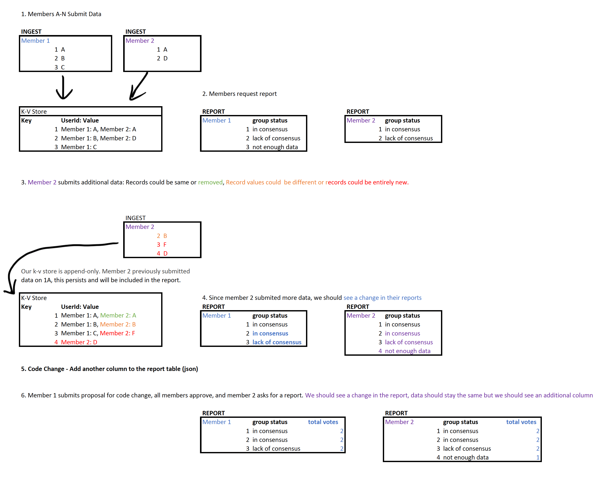

# Data Reconciliation Demo

In the future, this demo could have a UI to demonstrate how easy it is to deploy a mCCF network and highlight mCCF’s governance capabilities. However this demo will be via the command-line.

## Data

We will be demonstrating a reference data set where lei as a unique identifier and nace codes as the attributes.

## Part 1: Deploy and reconcile data

1. Deploy data reconciliation
   - Inputs: Constitution, Activate initial n members (certs), Initial App​ deployed
   - Output: mCCF network running latest build of reconciliation app, default constitution, 3 members have equal votes on decision, unanimous approval to advance proposals.
2. [Member 0](../test/data-samples/member0_demo_pt1.json), [Member 1](../test/data-samples/member1_demo.json) & [Member 2](../test/data-samples/member2_demo.json) upload their data (JSON)
3. Each member queries for their data report (JSON returned)

## Part 2: Change in data

5. [Member 0](../test/data-samples/member0_demo_pt2.json) uploads a small change to the existing dataset (JSON)
6. Members 0, 1, 2 are able to see the change in their respective reports

## Part 3: Code update

7. Member 0 submits proposal of code change to the network​ to expose some additional data
   - We will demo adding a another field (`total_vote_count`) to our reporting object. `total_vote_count` is the number of members who submitted data on that data record.
8. Member 1 & 2 approve the proposal​
9. Member 1 views updated report with additional data (`total_vote_count`) added by the proposal

## Reference

What will this demo look like? For reference,  is an simplified example (2 members, smaller, simplified data set).
