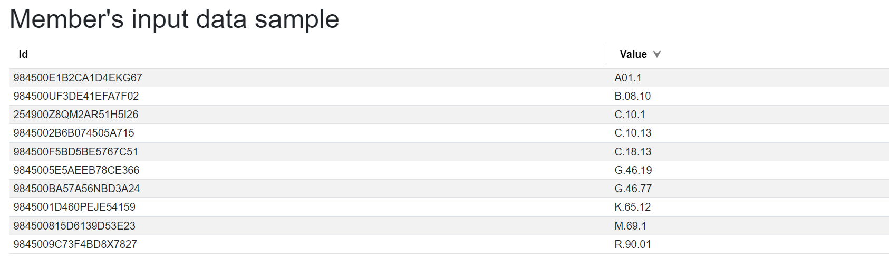
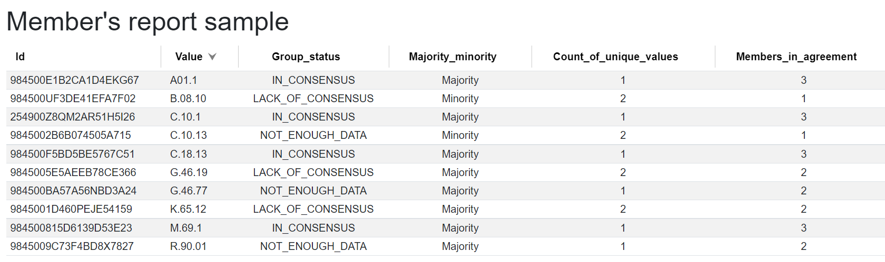
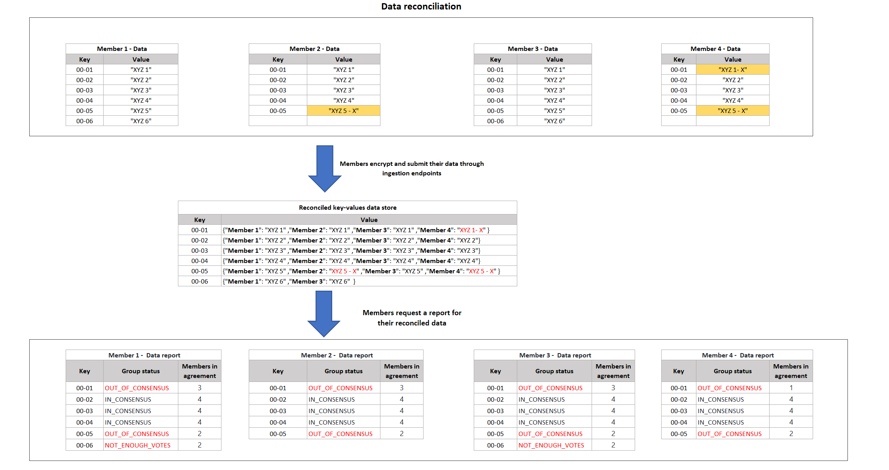

# CCF (Confidential Consortium Framework) Demo

## What is CCF?

The Confidential Consortium Framework (CCF) is an open-source framework for building a new category of **secure**, **highly-available**, and **performant applications** that focus on **multi-party** compute and data.

Leveraging the power of trusted execution environments (TEE, or "enclave"), decentralised systems concepts, and cryptography, CCF enables enterprise-ready multiparty systems.

CCF is based on web technologies; clients interact with CCF JavaScript applications over HTTPS.

## CCF Network Attributes

- **Nodes** [Run on TEE > secure] [multi-nodes > highly-available and performant]
- **Constitution** [How the network will be governed- JavaScript module that defines possible governance actions, and how members’ proposals are validated, resolved and applied to the service]
- **Operators** [In charge of operating a CCF network (e.g. adding or removing nodes)]
- **Members** [Constitute the consortium governing a CCF network (proposal submission and voting), such as banks]
- **Users** [Users directly interact with the application running in CCF (bank customers)]
- **Proposals** [Used to deploy any network change (application upgrade - Add new members - Add new users - open or close the Network)]
- **Ledger** [All changes to the Key-Value Store are encrypted and recorded to disc by each network node, resulting in a decentralised auditable ledger]
- **Application** (the business application)

## Secure multi-party Applications

Business transactions and project collaboration require sharing information amongst multiple parties. Often, the data being shared is confidential. The data may be personal information, financial records, medical records, private citizen data, etc. Public and private organizations require their data be protected from unauthorized access. Sometimes these organizations even want to protect data from computing infrastructure operators or engineers.

Azure confidential computing lets you process data from multiple sources without exposing the input data to other parties. This type of secure computation enables scenarios such as anti-money laundering, fraud-detection, and secure analysis of healthcare data.

In secure multi-party computing, encrypted data goes into the enclave. The enclave decrypts the data using a key, performs analysis, gets a result, and sends back an encrypted result that a party can decrypt with the designated key.

[Secure multi-party systems](https://learn.microsoft.com/en-us/azure/confidential-computing/use-cases-scenarios) can be developed using CCF framework which could be written in [TypeScript, JavaScript, C++, and more will be supported in the future]

## Data Reconciliation Application

**Use Case:** Multiple parties (organisations - Banks - companies) need to process their confidential data **without exposing the input data to other parties**. This type of secure computation enables scenarios such as anti-money laundering, fraud-detection, and secure analysis of healthcare data. 

**Proposed Solution:** A **data reconciliation service** will be hosted on a CCF network where members can submit their data to be reconciled against "each other's data" in a confidential manner, to performs analysis and generate some data-insights. 

In secure multi-party computing, encrypted data goes into the enclave. The enclave decrypts the data using a key, performs analysis, gets a result, and sends back an encrypted result that a party can decrypt with the designated key.

**Data Schema:** Data schema will be agreed by members 
- Unique key: uniquely identifying each record.
- Value: to be reconciled with other members' data. 

## Functional  Requirements
- Members can submit their data as a single record or a batch
- Members can update their data
- Each member can request a reconciliation report for all records or specific record (by UniqueId)
- No member can access other member's data

### Application

The reconciliation application will consist of three main parts.

- Data ingestion
  - Accept single or batch of records
- Data reconciliation
  - The voting concept will be used to reconcile data (all members submit their records as opinion)
  - Data is compared across all members, all members' data carry equal weight to reach consensus.
  - Reconciliation is on each record, not on the entire data set.
- Data reporting
  - API Endpoint: Members will query for results
    - Query by specific record by `a unique identifier`
    - Query all data
 
When a new record(s) is submitted through ingestion endpoints, the application will search the key-value store by the record's key; if this key does not exist, it will be added; otherwise, a vote is added to this record with a member ID and the submitted value.

## Managed CCF (mCCF)

## Resources

[https://microsoft.github.io/CCF/main/overview/index.html](https://microsoft.github.io/CCF/main/overview/index.html)
