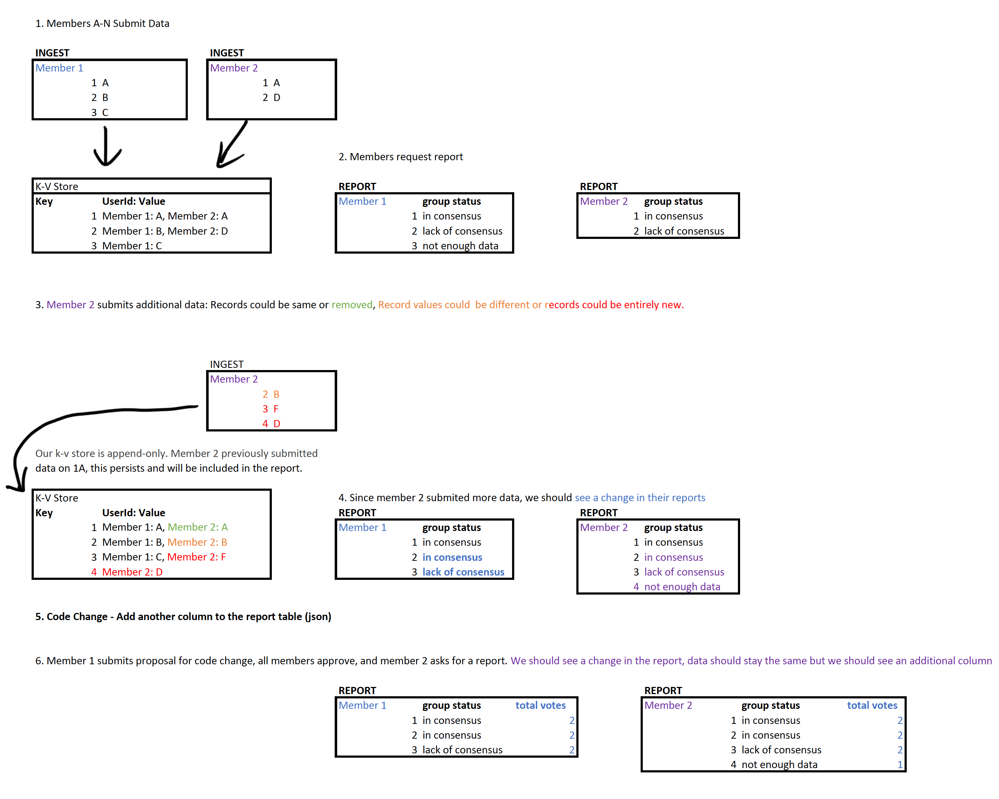

# FSI DEMO > CCF (Confidential Consortium Framework)

## Context

We are the Neutrino team, currently working on internal engagement with the CCF team to
- Upskilling on CCF concept and application 
- Improve developer experience by providing documentation feedback.
- Create a new application sample (data reconciliation).

## What is CCF?

The Confidential Consortium Framework (CCF) is an open-source framework for building a new category of secure, highly-available, and performant applications that focus on multi-party compute and data.

Leveraging the power of trusted execution environments (TEE, or "enclave"), decentralised systems concepts, and cryptography, CCF enables enterprise-ready multiparty systems.

CCF is based on web technologies; clients interact with CCF JavaScript applications over HTTPS.

## CCF Network Attributes

- **Nodes** [Run on TEE > secure] [multi-nodes > highly-available and performant]
- **Constitution** [How the network will be governed- JavaScript module that defines possible governance actions, and how members’ proposals are validated, resolved and applied to the service]
- **Operators** [Are in charge of operating a CCF network (e.g. adding or removing nodes)]
- **Members** [Constitute the consortium governing a CCF network (proposal submission and voting), such as banks]
- **Users** [Users directly interact with the application running in CCF (bank customers)]
- **Proposals** [Used to deploy any network change (application upgrade - Add new members - Add new users - open or close the Network)]
- **Ledger** [All changes to the Key-Value Store are encrypted and recorded to disc by each network node, resulting in a decentralised auditable ledger]
- **Application** (the business application)

## Secure multi-party Applications

Business transactions and project collaboration require sharing information amongst multiple parties. Often, the data being shared is confidential. The data may be personal information, financial records, medical records, private citizen data, etc. Public and private organizations require their data be protected from unauthorized access. Sometimes these organizations even want to protect data from computing infrastructure operators or engineers, security architects, business consultants, and data scientists.

For example, using machine learning for healthcare services has grown massively as we've obtained access to larger datasets and imagery of patients captured by medical devices. Disease diagnostic and drug development benefit from multiple data sources. Hospitals and health institutes can collaborate by sharing their patient medical records with a centralized trusted execution environment (TEE). Machine learning services running in the TEE aggregate and analyze data. This aggregated data analysis can provide higher prediction accuracy due to training models on consolidated datasets. With confidential computing, the hospitals can minimize risks of compromising the privacy of their patients.

Azure confidential computing lets you process data from multiple sources without exposing the input data to other parties. This type of secure computation enables scenarios such as anti-money laundering, fraud-detection, and secure analysis of healthcare data.

Multiple sources can upload their data to one enclave in a virtual machine. One party tells the enclave to perform computation or processing on the data. No parties (not even the one executing the analysis) can see another party's data that was uploaded into the enclave.

In secure multi-party computing, encrypted data goes into the enclave. The enclave decrypts the data using a key, performs analysis, gets a result, and sends back an encrypted result that a party can decrypt with the designated key.

[Secure multi-party systems](https://learn.microsoft.com/en-us/azure/confidential-computing/use-cases-scenarios) can be developed using CCF framework which could be written in [TypeScript, JavaScript, C++, and more will be supported in the future]

## Data Reconciliation Application

The CCF network will be used to host a reconciliation service where different parties with membership (banks and data providers) will be able to submit their own data to be reconciled against "each other's data" in a confidential manner without exposing the data to other members in the network.

The solution will use the voting process to reconcile members' data; on the data submission, when new record is submitted the app will check if it does not exist in the key-value store, it will be added; otherwise, a vote is added to this record with a member ID, and the vote will be "agree" if data attributes match; otherwise, it will "disagree."

This solution is generic to handle scenarios of data collaboration amongst different parties, and share reconciled results out on that data.

### Application

The reconciliation application will consist of three main services.

- Data ingestion
  - Accept single or batch of records
- Data reconciliation
  - The voting concept will be used to reconcile data (all members submit their records as opinion)
  - Data is compared across all members, all members' data carry equal weight to reach consensus.
  - Reconciliation is on each record, not on the entire data set.
- Data reporting
  - API Endpoint: Members will query for results
    - Query by specific record by `a unique identifier`
    - Query all data

## Managed CCF (mCCF)

## Samples Repo

A sample application for a bank consortium: A bank system that can be run by multiple banks

https://github.com/microsoft/ccf-app-samples

## Resources

[https://microsoft.github.io/CCF/main/overview/index.html](https://microsoft.github.io/CCF/main/overview/index.html)
